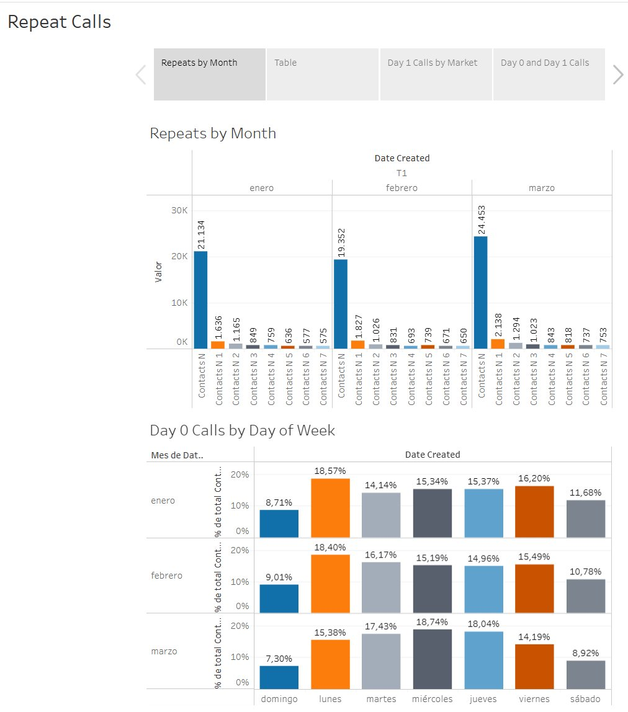
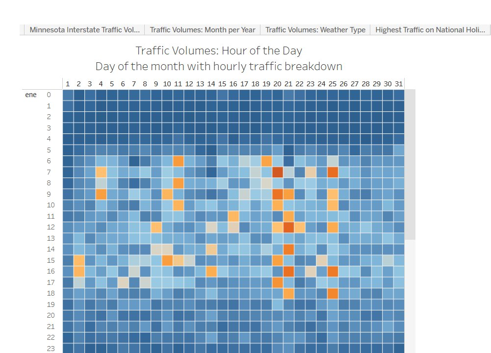
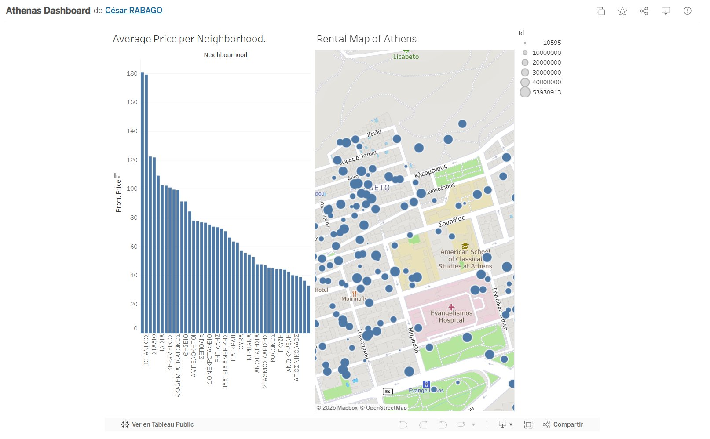

# 📈 Tableau Portfolio — César Rábago

> 3 dashboards interactivos publicados en Tableau Public. Cada visualización fue diseñada para responder preguntas de negocio reales y demostrar storytelling con datos en distintos dominios: **telecomunicaciones, transporte público y real estate**.

---

## 🔗 Perfil completo en Tableau Public

👉 **[public.tableau.com/app/profile/cesarrabago/vizzes](https://public.tableau.com/app/profile/cesarrabago/vizzes)**

---

## 📊 Dashboards

### 1. Google Fiber — Repeat Calls Analysis

**Stack:** Tableau Desktop · Tableau Public
**Dominio:** Telecomunicaciones · Servicio al cliente
**Contexto:** Análisis de llamadas repetidas (Repeat Calls) al servicio de soporte de Google Fiber durante el primer trimestre. Combina cuatro vistas navegables: Repeats by Month, tabla de detalle, Day 1 Calls by Market y Day 0 vs Day 1 Calls.
**Insight principal:** El volumen de Contacts N (primer contacto) se mantiene en ~20K mensuales con un pico de **24,453 en marzo**, mientras que las llamadas subsecuentes (N1–N7) caen drásticamente. Los lunes concentran la mayor proporción de Day 0 Calls (~18%) — patrón clave para staffing de soporte.

🔗 **[Ver dashboard en vivo](https://public.tableau.com/app/profile/cesarrabago/viz/GoogleBIGoogleFiberExemplar/RepeatCalls)**

---

### 2. Minnesota Interstate Traffic Volume

**Stack:** Tableau Desktop · Tableau Public
**Dominio:** Transporte · Análisis de series de tiempo
**Contexto:** Dashboard del volumen de tráfico interestatal en Minnesota con cuatro vistas: Traffic Volumes Overview, Month per Year, Weather Type y Highest Traffic on National Holidays. La vista principal es un heatmap de hora del día × día del mes que revela patrones de congestión.
**Insight principal:** Concentración clara de tráfico pico entre las **6 AM y 5 PM**, con intensidad máxima en días entre semana y caída notable en madrugadas. El cruce con tipo de clima permite identificar el impacto de condiciones meteorológicas en el volumen vehicular.

🔗 **[Ver dashboard en vivo](https://public.tableau.com/app/profile/cesarrabago/viz/GoogleBIMinnesotaTrafficVolumeDashboard_17386335777440/MinnesotaInterstateTrafficVolume)**

---

### 3. Athens Rental Market Dashboard

**Stack:** Tableau Desktop · Tableau Public · Mapbox
**Dominio:** Real Estate · Análisis geoespacial
**Contexto:** Análisis del mercado de rentas en Atenas, Grecia. Combina un ranking de Average Price per Neighborhood con un mapa interactivo (Rental Map of Athens) que georreferencia cada propiedad con tamaño proporcional a su valor.
**Insight principal:** Botanikos lidera el ranking con **~€180 promedio por noche**, casi **6x más** que los barrios al final del ranking (~€30). El mapa revela concentración de propiedades premium en zonas céntricas cercanas a Lycabettus y Evangelismos.

🔗 **[Ver dashboard en vivo](https://public.tableau.com/app/profile/cesarrabago/viz/AthenasDashboard/Dashboard1)**

---

## 🛠️ Stack

Tableau Desktop · Tableau Public · Mapbox (visualización geoespacial)

---

*César Rábago · BI Analyst · Monterrey, N.L.*
